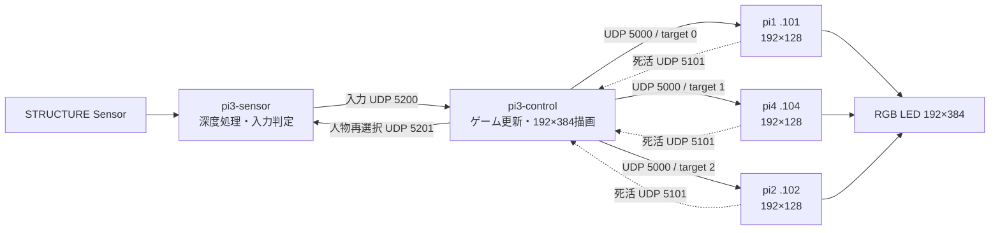

# RGB LED インタラクティブゲーム

STRUCTURE Sensorで検出した人物の動きを、192×384の縦型RGB LED表示へ反映する
インタラクティブゲーム。現行実機は、センサーPi 1台、制御Pi 1台、表示Pi 3台、
32×32 RGB LEDパネル72枚で構成する。

仕様の唯一の正典は [`spec.md`](spec.md)。判断に迷った場合は推測せず、同ファイルを参照する。
本READMEと `spec.md` が矛盾した場合は `spec.md` を正とする。

## 現行実機構成

2026-09-04に制御Piと表示Pi 3台の稼働サービスを読み取って確認した構成。
センサーPiの行は現行サービス定義に基づく。

| 役割 | ホスト | アドレス | 現行設定 |
|---|---|---|---|
| センサー | `pi3-sensor` | `192.168.50.33` | 深度取得、人物検出、入力判定 |
| ゲーム制御 | `pi3-control` | `192.168.50.32` / `192.168.10.2` | 60fps、MSX16、192×384描画 |
| 表示1 | `pi1` | `192.168.10.101` | `target_id 0`、192×128 |
| 表示2 | `pi4` | `192.168.10.104` | `target_id 1`、192×128 |
| 表示3 | `pi2` | `192.168.10.102` | `target_id 2`、192×128 |

表示Pi 1台あたりは、32×32パネルを横8枚×縦3枚で駆動する。3台を縦に積み、
横192px×縦384px、合計72枚の表示面を構成する。



深度画像や人物マスクはネットワークへ送らない。センサーPiが判定した
`body_x`、左右移動、ジャンプ、開始イベント、人物IDなどだけを制御Piへ送る。

## 現行サービス

制御Piでは次の処理が稼働している。

```text
block_breaker.py
  --input-bind 0.0.0.0:5200
  --input-timeout 0.50
  --sensor-control 192.168.50.33:5201
  --start-mode still
  --play-range 0.15,0.85
  --position-gain 0.9
  --fps 60
  --palette msx16
  --pi 192.168.10.101:5000
  --pi 192.168.10.104:5000
  --pi 192.168.10.102:5000
```

表示Piでは `pi-client@N.service` が常駐し、UDPチャンクのCRC・完全性・パレット範囲を
検証してから、HUB75へ表示する。各Piは1秒ごとにFPS・欠損数・温度をUDP 5101へ返す。

## 処理の流れ

1. センサーPiが起動後に背景深度を学習する。
2. 背景より手前の領域から人物候補を抽出し、最も手前の安定した人物を操作対象にする。
3. 同じ横位置で3秒間静止すると、制御Piが開始カウントダウンへ入る。
4. 制御Piがゲームを60fpsで更新し、192×384のMSX16インデックス画像を描画する。
5. 画像を上から192×128ずつ3分割し、表示PiへUDP送信する。
6. 表示Piがチャンクを再構成し、LUT変換・パネル補正後に `SwapOnVSync` で表示する。
7. ミスまたはステージ切替時は人物ロックを解除し、操作対象を再選択する。

## 主なコード

| パス | 役割 |
|---|---|
| `host/sensor_agent.py` | センサーPiの常駐処理 |
| `host/block_breaker.py` | センサー判定、ゲーム更新、描画 |
| `host/input_transport.py` | 入力UDPと人物再選択UDP |
| `host/frame_source.py` | C++深度取得プロセスの受信 |
| `host/structure_depth_capture.cpp` | OpenNI2深度取得 |
| `host/test_mode/test_mode.py` | フレーム分割・UDP送信 |
| `pi-client/pi_client.cc` | 表示Piの受信・再構成・HUB75出力 |
| `host/palettes.py` | FC6／MSX16パレットの正本 |

## 開発環境

```bash
python3 -m venv .venv
.venv/bin/pip install -r requirements.txt
```

主要なロジック検証:

```bash
.venv/bin/python host/block_breaker_selftest.py
.venv/bin/python host/input_transport_selftest.py
.venv/bin/python host/frame_source_selftest.py
.venv/bin/python host/sensor_runtime_selftest.py
```

実機状態の確認:

```bash
ssh takemuralab@192.168.10.2 'systemctl status pi3-control.service --no-pager'
ssh takemuralab@192.168.10.101 'systemctl status pi-client@0.service --no-pager'
ssh takemuralab@192.168.10.104 'systemctl status pi-client@1.service --no-pager'
ssh takemuralab@192.168.10.102 'systemctl status pi-client@2.service --no-pager'
```

## 現在の制約

- READYバリア（UDP 5100）とGPIO物理同期は未実装。
- UDPは到達保証を持たない。表示Piは不完全フレームと不正フレームを破棄する。
- リポジトリ内の送信・表示定数とsystemdテンプレートには、実機へ配備済みの
  3台・192×128構成が未反映の箇所がある。再配備前に `spec.md` §10 の差分を解消すること。
- 実機への書き込みは、対象サービスと差分を確認してから行う。

## 文書

- [`spec.md`](spec.md): 現行仕様の唯一の正典
- [`docs/outdated_README.md`](docs/outdated_README.md): 退避した旧README
- [`docs/outdated_spec.md`](docs/outdated_spec.md): 退避した旧開発計画書
- [`docs/outdated_SYSTEM_ARCHITECTURE.md`](docs/outdated_SYSTEM_ARCHITECTURE.md): 退避した旧構成図
- [`LICENSE`](LICENSE): AGPL-3.0
