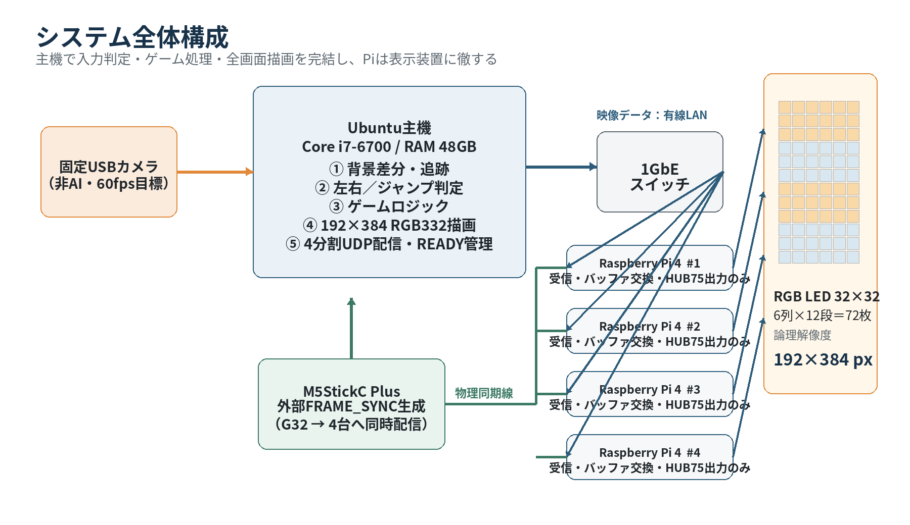
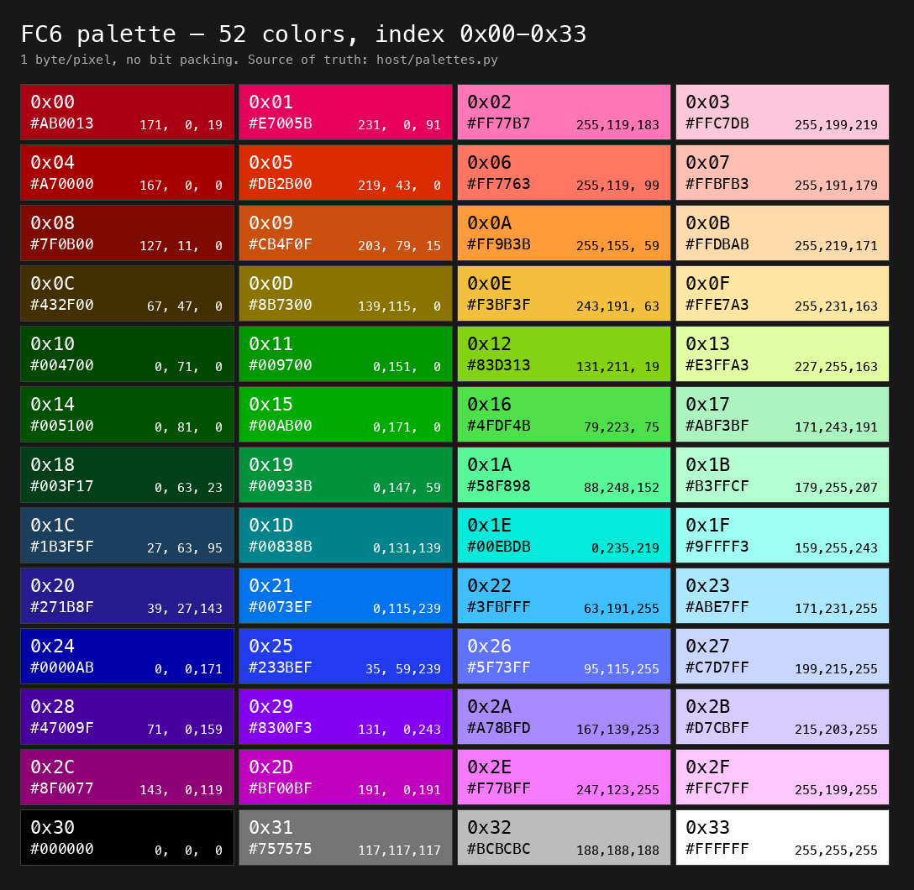
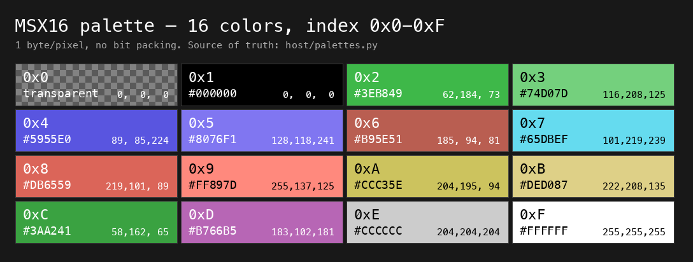
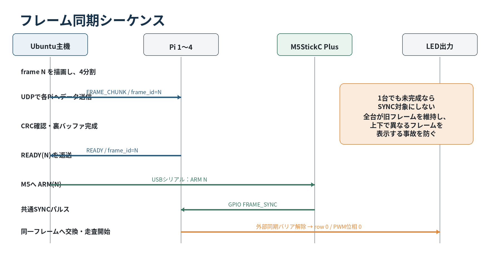

# RGB LEDマトリックス縦型インタラクティブゲーム開発計画書（設計原案・旧4台構成）

**方式:** 主機集中処理・Raspberry Pi外部同期方式  
**版:** 1.2  
**作成日:** 2026年8月5日  
**対象:** 大学ハッカソン

> **現行実機との関係:** 現行は制御Pi `pi3-control`、センサーPi `pi3-sensor`、表示Pi
> `pi1`（`.101` / `target_id 0`）、`pi2`（`.102` / `target_id 1`）、`pi4`
> （`.104` / `target_id 3`）の3台表示構成で運用する。現行の接続先・起動手順は
> [docs/CONNECTION_INFO.md](CONNECTION_INFO.md)を正本とする。本書の4台構成は設計時点の
> 原案・将来拡張・検証用の記録として残しており、現行運用の手順ではない。

## 1. 計画概要

### 1.1 目的

32×32 RGB LEDパネル72枚を6列×12段に配置し、論理解像度192×384ピクセルの縦型ディスプレーを構成する。参加者の左右移動およびジャンプを非接触で検出し、パドルを身体で操作するブロック崩しを実現する。

本計画では、4台のRaspberry Pi間の表示ずれを最重要リスクとして扱う。センサー処理、入力判定、ゲームロジック、描画、フレーム確定はUbuntu主機へ集約する。Pi側は完成済みパレットインデックス配列の受信、裏バッファ保持、外部同期、HUB75出力だけを担当する。

### 1.2 体験内容

- プレイヤーがカメラ前を左右へ移動すると、DOTパドルが同方向へ移動する。
- プレイヤーのジャンプを検出すると、サーブ中のボールを発射する。
- ボールでブロックを消し、反射を続けながら得点を増やす。
- 人物映像や人影はLEDへ描画しない。
- AI推論、人物認識モデル、骨格推定は使用しない。

### 1.3 前提・制約

| 項目 | 決定内容 |
|---|---|
| LED構成 | 32×32パネル×72枚、6列×12段、192×384ピクセル |
| Pi構成 | Pi 1台あたり6列×3段＝18枚、192×96ピクセル。4台を縦積み |
| 主機 | Ubuntu、Core i7-6700、RAM 48GB、GT 730 |
| 処理分担 | 入力判定・ゲーム・描画・送信管理を主機へ集約 |
| Piの役割 | 受信、固定バッファへの格納、外部同期、HUB75出力のみ |
| 同期 | 共通`frame_id`、READYバリア、M5StickC Plusの物理同期線 |
| 非採用 | AI、人物描画、圧力センサー、専用同期型LEDコントローラ、Pi側ゲーム処理 |

> **重要:** 4台のPiで同じゲーム状態を個別描画する方式は採用しない。主機が完成させたピクセル配列を送り、同一フレーム番号を物理同期信号で切り替える。

## 2. システム構成



### 2.1 機器別の役割

| 機器 | 担当処理 | 禁止・抑制する処理 |
|---|---|---|
| Ubuntu主機 | カメラ取得、前景抽出、左右・ジャンプ判定、ゲーム更新、192×384描画、パレット量子化、4分割、UDP送信、READY管理、M5制御 | Piごとに異なるゲーム状態を持たせない |
| Raspberry Pi 4 ×4 | UDP受信、チャンク再構成、CRC確認、裏バッファ保持、同期待機、HUB75出力 | ゲームロジック、画像生成、圧縮・解凍、動画プロセス起動 |
| M5StickC Plus | ハードウェアタイマーによる`FRAME_SYNC`、起動時`GLOBAL_START` | 画像処理、ゲーム判断、フレーム配信 |
| USBカメラ | 固定画角でプレイヤーを取得 | 人物映像のLED転送 |
| 1GbEスイッチ | 主機と4台のPiを接続する専用有線LAN | Wi-Fi経由のフレーム配信 |

## 3. 入力検出方式

### 3.1 基本方式

固定USBカメラとOpenCVの古典的画像処理を使用する。

1. 60fpsを目標にカメラ画像を取得する。
2. 露出、ゲイン、ホワイトバランスを可能な限り固定する。
3. ROI切り出し、縮小、グレースケール化、平滑化を行う。
4. MOG2背景差分またはフレーム差分で前景マスクを生成する。
5. 二値化、収縮・膨張、面積しきい値でノイズを除去する。
6. 最大連結成分から重心X・Y、外接矩形下端、面積を求める。
7. 時系列フィルタと状態機械で`LEFT`、`RIGHT`、`JUMP`、`IDLE`へ変換する。

### 3.2 操作判定

| 入力 | 判定方法 | 誤検出対策 |
|---|---|---|
| 左移動 | 重心Xが中央域より左へ移動し、X方向速度が負 | ヒステリシス、100〜200msの確定時間 |
| 右移動 | 重心Xが中央域より右へ移動し、X方向速度が正 | 同上 |
| ジャンプ | 重心Yと人物領域下端が同時に上昇し、その後復帰 | 床基準の校正、クールダウン、上昇・滞空・着地の状態機械 |
| 無入力 | 移動量がしきい値未満、または人物領域なし | 待機状態へ遷移。背景更新は人物不在時に限定 |

### 3.3 センサー代替案

| 方式 | 評価 | 扱い |
|---|---|---|
| 通常USBカメラ | 安価で既存コードを流用可能。照明変化や影に弱い | 第一候補 |
| 深度カメラ | 距離しきい値で人物領域を分離可能。AI不要 | 通常カメラが不安定な場合の第一フォールバック |
| 2D LiDAR | 左右位置には有効だが、単一走査面ではジャンプ判定が難しい | 単独採用しない |
| イベントカメラ | 低遅延だがLEDのPWM・反射光、静止時の情報不足、実装複雑性が問題 | 採用しない |

## 4. 描画・カラーパレット仕様

### 4.1 主機での全画面描画

主機は192×384の単一フレームバッファへ、背景、ブロック、パドル、ボール、スコア、演出をすべて描画する。描画終了後に指定パレットへ量子化し、縦方向へ96ピクセルずつ4分割する。

### 4.2 パレットモード

| モード | 識別値 | 色数 | 用途 |
|---|---:|---:|---|
| `FC6` | `0x00` | 64色 | 通常ゲーム表示。ファミリーコンピュータ風の色表現 |
| `MSX16` | `0x01` | 16色 | 強いレトロ表現、タイトル、簡易演出、デバッグ |

### 4.3 伝送上の画素形式

Pi側の処理時間を短く一定にするため、ビットパックは行わない。

```text
1画素 = 1 byte
FC6   : 下位6bitを使用（0x00〜0x3F）、上位2bitは0
MSX16 : 下位4bitを使用（0x0〜0xF）、上位4bitは0
```

- 6bppへ詰める方式は通信量を25%削減できるが、Pi側の展開処理と分岐が増えるため不採用とする。
- 4bppへ詰める方式も同様に不採用とする。
- パレット変換、透明合成、色量子化は主機で完了させる。
- Piは受信値を固定LUTへ通してRGBへ変換するだけとする。
- MSXのインデックス`0`の透明色は主機内部のレイヤー合成専用であり、送信前に背景色へ解決する。

### 4.4 6bit FC mode

> **本リポジトリでの変更（2026-08-06）:** FC6 は以下の 64 色表ではなく、52 色（`0x00`〜`0x33`）へ変更した。正本は `host/palettes.py` / `host/palettes.json`。見本画像 `assets/fc6_palette.png` は 52 色版へ再生成済み（`host/make_palette_sheet.py`）。以下の 64 色表は旧版であり、インデックス互換性はない。伝送形式（1画素1バイト、上位ビット0）は変更なし。



| Index | HEX | RGB | Index | HEX | RGB | Index | HEX | RGB | Index | HEX | RGB |
|---:|---|---|---:|---|---|---:|---|---|---:|---|---|
| `00` | `#757575` | 117, 117, 117 | `01` | `#271B8F` | 39, 27, 143 | `02` | `#0000AB` | 0, 0, 171 | `03` | `#47009F` | 71, 0, 159 |
| `04` | `#8F0077` | 143, 0, 119 | `05` | `#AB0013` | 171, 0, 19 | `06` | `#A70000` | 167, 0, 0 | `07` | `#7F0B00` | 127, 11, 0 |
| `08` | `#432F00` | 67, 47, 0 | `09` | `#004700` | 0, 71, 0 | `0A` | `#005100` | 0, 81, 0 | `0B` | `#003F17` | 0, 63, 23 |
| `0C` | `#1B3F5F` | 27, 63, 95 | `0D` | `#000000` | 0, 0, 0 | `0E` | `#000000` | 0, 0, 0 | `0F` | `#000000` | 0, 0, 0 |
| `10` | `#BCBCBC` | 188, 188, 188 | `11` | `#0073EF` | 0, 115, 239 | `12` | `#233BEF` | 35, 59, 239 | `13` | `#8300F3` | 131, 0, 243 |
| `14` | `#BF00BF` | 191, 0, 191 | `15` | `#E7005B` | 231, 0, 91 | `16` | `#DB2B00` | 219, 43, 0 | `17` | `#CB4F0F` | 203, 79, 15 |
| `18` | `#8B7300` | 139, 115, 0 | `19` | `#009700` | 0, 151, 0 | `1A` | `#00AB00` | 0, 171, 0 | `1B` | `#00933B` | 0, 147, 59 |
| `1C` | `#00838B` | 0, 131, 139 | `1D` | `#000000` | 0, 0, 0 | `1E` | `#000000` | 0, 0, 0 | `1F` | `#000000` | 0, 0, 0 |
| `20` | `#FFFFFF` | 255, 255, 255 | `21` | `#3FBFFF` | 63, 191, 255 | `22` | `#5F73FF` | 95, 115, 255 | `23` | `#A78BFD` | 167, 139, 253 |
| `24` | `#F77BFF` | 247, 123, 255 | `25` | `#FF77B7` | 255, 119, 183 | `26` | `#FF7763` | 255, 119, 99 | `27` | `#FF9B3B` | 255, 155, 59 |
| `28` | `#F3BF3F` | 243, 191, 63 | `29` | `#83D313` | 131, 211, 19 | `2A` | `#4FDF4B` | 79, 223, 75 | `2B` | `#58F898` | 88, 248, 152 |
| `2C` | `#00EBDB` | 0, 235, 219 | `2D` | `#757575` | 117, 117, 117 | `2E` | `#000000` | 0, 0, 0 | `2F` | `#000000` | 0, 0, 0 |
| `30` | `#FFFFFF` | 255, 255, 255 | `31` | `#ABE7FF` | 171, 231, 255 | `32` | `#C7D7FF` | 199, 215, 255 | `33` | `#D7CBFF` | 215, 203, 255 |
| `34` | `#FFC7FF` | 255, 199, 255 | `35` | `#FFC7DB` | 255, 199, 219 | `36` | `#FFBFB3` | 255, 191, 179 | `37` | `#FFDBAB` | 255, 219, 171 |
| `38` | `#FFE7A3` | 255, 231, 163 | `39` | `#E3FFA3` | 227, 255, 163 | `3A` | `#ABF3BF` | 171, 243, 191 | `3B` | `#B3FFCF` | 179, 255, 207 |
| `3C` | `#9FFFF3` | 159, 255, 243 | `3D` | `#BCBCBC` | 188, 188, 188 | `3E` | `#000000` | 0, 0, 0 | `3F` | `#000000` | 0, 0, 0 |

重複色および黒の予約インデックスも、指定された番号を保持する。色が同じでもインデックスを自動統合しない。

### 4.5 16color MSX mode



| Index | Color | Index | Color | Index | Color | Index | Color |
|---:|---|---:|---|---:|---|---:|---|
| `0` | `透明` | `1` | `#000000` | `2` | `#3EB849` | `3` | `#74D07D` |
| `4` | `#5955E0` | `5` | `#8076F1` | `6` | `#B95E51` | `7` | `#65DBEF` |
| `8` | `#DB6559` | `9` | `#FF897D` | `A` | `#CCC35E` | `B` | `#DED087` |
| `C` | `#3AA241` | `D` | `#B766B5` | `E` | `#CCCCCC` | `F` | `#FFFFFF` |

色`8`は入力値`DB6559`を`#DB6559`として登録する。

### 4.6 パレット成果物

| ファイル | 内容 |
|---|---|
| `palettes.json` | インデックス、HEX、RGB、α、通信形式の機械可読定義 |
| `palettes.hpp` | 主機・Piで共有可能なC++20 `constexpr` LUT |
| `palettes.py` | テストツール、素材変換用Python定義 |
| `fc6.pal` | 64×RGB、192バイトの生パレット |
| `msx16.pal` | 16×RGB、48バイトの生パレット。透明情報はJSON/C++側で管理 |

### 4.7 WBMP DVDテストモード


ゲーム本体とカメラ入力の実装前に、表示経路・パレット・4台境界・同期を検証する専用テストモードを設ける。主機のローカルファイル`test.wbmp`をType-0 WBMPとして読み込み、192×384の論理画面内をDVDプレイヤーのロゴのように反射移動させる。

| 項目 | 仕様 |
|---|---|
| 入力素材 | `test.wbmp`、Type-0、1bitモノクロ |
| 座標計算 | 主機。浮動小数点位置を保持し、描画時に整数座標化 |
| 移動 | X・Y独立速度。四辺への衝突時に反射し、範囲外へ出さない |
| 着色 | FC6またはMSX16の登録済みインデックスだけを使用 |
| 既定演出 | 画像内をパレット順の虹色帯にし、時間経過と反射で色位相を進める |
| 代替演出 | 画像全体を単色にし、時間経過・反射で色を変更する |
| 背景 | FC6は`0x0D`、MSX16は`0x1`を既定の黒とする |
| 出力 | 192×384の1byte/pixelインデックス画面を96行ずつ4分割 |
| Pi側 | WBMP読込み、移動計算、虹色生成を行わない |

虹色表現ではRGB補間や任意色生成を行わず、各パレットから可視性の高い有彩色インデックスを抽出した固定循環表を使う。したがって送出値は常にFC6の`0x00〜0x3F`またはMSX16の`0x0〜0xF`に収まる。MSXの透明色`0`は送出せず、合成後の背景色へ解決する。

主機のテストプログラムは`test_mode/test_mode.py`とし、次の機能を持つ。

- WBMPの独自Type-0読込みと入力反転
- 大きすぎる画像の最近傍縮小
- FC6/MSX16の実行時切替
- ローカルOpenCVプレビュー
- 60fps基準の反射移動
- 4台のPiへのUDPチャンク送信
- 共通`frame_id`、`target_id`、パレットモード、CRC32の付与
- フレーム生成が遅れた場合に古い期限を捨て、遅延を蓄積しない制御

実行例:

```bash
cd test_mode
python3 test_mode.py --image test.wbmp --palette fc6
```

4台へ送信する場合:

```bash
python3 test_mode.py --image test.wbmp --palette fc6 --send \
  --pi 192.168.10.101:5000 --pi 192.168.10.102:5000 \
  --pi 192.168.10.103:5000 --pi 192.168.10.104:5000
```

開発用の`test_mode/udp_preview.py`は、同一PC上で4領域を再結合し、4台分が同じ`frame_id`になった場合だけ表示する。これは本番Piクライアントの代替ではなく、主機の分割・ヘッダー・CRC・フレーム整合を先に確認するためのシミュレータとする。

## 5. 通信方式

### 5.1 データ量

1画素1バイト固定のため、FC6とMSX16で通信量は同じである。

| 対象 | 計算 | データ量 |
|---|---:|---:|
| 全画面1フレーム | 192×384×1 | 73,728 byte |
| Pi 1台分 | 192×96×1 | 18,432 byte |
| 全体60fps | 73,728×60 | 約4.42 MB/s、約35.4 Mbps |
| Pi 1台60fps | 18,432×60 | 約1.11 MB/s |

1GbEに対して十分小さいため、RLE、PNG、動画圧縮、差分フレームは使用しない。

### 5.2 フレームヘッダー

```cpp
#pragma pack(push, 1)
struct FrameChunkHeader {
    std::uint32_t magic;
    std::uint32_t frame_id;
    std::uint8_t  target_id;      // 0..3
    std::uint8_t  palette_mode;   // 0=FC6, 1=MSX16
    std::uint16_t chunk_id;
    std::uint16_t chunk_count;
    std::uint16_t payload_size;
    std::uint32_t crc32;
};
#pragma pack(pop)
```

- UDPペイロードは約1,200〜1,400バイトとし、IPフラグメントを避ける。
- 各Piは`target_id`が自機と一致するパケットだけを格納する。
- パレット番号の範囲外値はフレーム不正としてREADYを返さない。
- 未完成フレームは表示しない。
- 古いフレームの再送を待たず、次のフレームを優先する。

## 6. Pi間同期方式



### 6.1 同期シーケンス

1. 主機がフレーム`N`をゲーム更新・描画・量子化する。
2. 主機が4台へ担当領域を送信する。
3. 各Piは全チャンクとCRCを確認し、`READY N`を返す。
4. 主機は4台すべてのREADYを確認する。
5. 主機がM5StickC Plusへ`ARM N`を送る。
6. M5が次の基準周期で`FRAME_SYNC`を出力する。
7. 4台が同じフレーム`N`を採用し、走査周期を再同期する。

4台のうち1台でもREADYでなければSYNCを出さず、全台が直前フレームを維持する。

### 6.2 M5StickC Plus

- G32: `FRAME_SYNC`
- G33: `GLOBAL_START`またはリセット補助
- 出力電圧: 3.3V
- 全PiとGND共通
- 同期線へ100〜330Ωの直列抵抗
- 本番は74LVC125等で4系統へバッファ分配
- Wi-Fi、Bluetooth、IMU、常時LCD更新を停止
- ESP32のハードウェアタイマーを使用し、ソフトウェア`delay()`へ依存しない

### 6.3 Pi側

Pi側処理は以下に限定する。

```text
UDP受信
  → 固定位置へmemcpy
  → CRC・パレット範囲確認
  → READY送信
  → GPIO同期待機
  → 裏表バッファ交換
  → HUB75出力
```

同期は段階的に実装する。

| 段階 | 内容 | 合格条件 |
|---|---|---|
| A: 論理同期 | 共通`frame_id`、READYバリア、GPIOでバッファ交換 | 上下で異なるフレームが混在しない |
| B: 走査同期 | `rpi-rgb-led-matrix`のリフレッシュループへ外部同期バリアを追加 | 高速撮影で境界の位相差が明確に観測されない |
| C: 長時間同期 | M5基準へ周期的に再同期 | 60分運転でずれが累積しない |

## 7. ソフトウェア構成

### 7.1 主機

```text
host/
├── camera_capture/       # カメラ取得・タイムスタンプ
├── motion_detector/      # 背景差分・連結成分
├── input_classifier/     # LEFT/RIGHT/JUMP状態機械
├── game_core/            # パドル、ボール、ブロック、衝突、スコア
├── renderer/             # 192×384描画、透明合成
├── palette/              # FC6/MSX16量子化・LUT
├── frame_transport/      # 4分割、UDP、CRC、READY
├── sync_controller/      # M5 ARM、期限管理
├── diagnostics/          # FPS、遅延、欠損、マスク確認
└── test_mode/            # WBMP反射移動・パレット・UDP試験
```

実装言語は既存資産に合わせてC++20、OpenCV、CMakeを基本とする。

### 7.2 Pi子機

```text
pi-client/
├── udp_receiver/
├── frame_assembler/
├── palette_lut/
├── sync_gate/
├── matrix_output/
└── health_report/
```

Pi側は動的メモリ確保、画像デコード、スプライト描画、ゲーム計算を避ける。受信バッファは起動時に固定確保する。

### 7.3 M5StickC Plus

```text
m5-sync/
├── serial_command/
├── hardware_timer/
├── sync_pulse/
└── status_ui/       # 試験時のみ
```

## 8. 既存資産の移行

| 既存資産 | 扱い | 理由 |
|---|---|---|
| 主機側の`VideoCapture`、グレースケール、差分処理 | 流用・再構成 | 非AI入力検出の基礎にできる |
| 4台のIP管理とUDP送信 | 流用・拡張 | トリガー文字列から固定バイナリフレームへ変更 |
| Pi側`chain=6`、`parallel=3` | 流用 | 現在の6×3パネル構成と一致 |
| `fork/exec`による`led-image-viewer`起動 | 廃止 | 起動時間の個体差と同期ずれを生む |
| MP4・stream素材 | 必要時のみ主機へ移行 | 主機でパレット化して同じフレーム経路へ流す |
| `rpi-rgb-led-matrix`ソース | 改造対象 | 外部SYNCバリアを追加する |

## 9. 開発工程

| 週 | 主な作業 | 完了条件 |
|---|---|---|
| 第1週 | パレット定義、WBMP DVDテストモード、主機192×384テスト画面、Pi 1台常駐表示 | `test.wbmp`がFC6/MSX16で反射移動し、全色テストパターンも正しく表示される |
| 第2週 | 1byte/pixel、UDPチャンク、CRC、`frame_id`、4分割 | 4台で静止画とスクロールバーを表示し、混在なし |
| 第3週 | M5同期パルス、GPIO受信、READYバリア | 240fps撮影で異なるゲームフレームが混在しない |
| 第4週 | 外部同期バリア、走査位相評価、長時間試験 | 境界ずれが肉眼で見えず、60分安定 |
| 第5週 | USBカメラ、背景差分、左右・ジャンプ、校正UI | 複数参加者で入力精度を計測できる |
| 第6週 | ゲーム統合、会場照明試験、復旧・安全試験 | 起動からゲーム開始まで自動化し、受入条件を満たす |

### 9.1 優先順位

1. Pi 1台でFC6/MSX16の常駐表示
2. 4台の論理フレーム同期
3. M5による物理同期と走査位相の評価
4. ゲーム本体
5. カメラ入力の安定化
6. 演出、効果音、装飾

## 10. 試験・受入条件

| 試験項目 | 方法 | 合格基準 |
|---|---|---|
| パレット一致 | 全インデックスを番号付きで表示し、主機プレビューと比較 | FC6 64色、MSX16 16色でインデックスずれなし |
| WBMP読込み | 複数サイズのType-0 WBMP、横幅8の倍数でない画像、反転指定を入力 | 寸法・ビット順・前景が一致し、破損ファイルを拒否する |
| DVD移動 | 四辺・四隅への衝突、長時間移動を確認 | 画面外へ出ず、停止・震動・座標飛びなし |
| 虹色制約 | 送出フレームの全画素値を検査 | 選択パレットの範囲外インデックスが0件 |
| Pi境界通過 | WBMPをY=96、192、288の境界へ通過させ、高速撮影 | 図形の欠け、上下フレーム混在、1フレーム断裂なし |
| 不正値処理 | FC6で`0x40`以上、MSXで`0x10`以上を注入 | 不正フレームを表示せず、次フレームで復旧 |
| フレーム整合 | 各領域へ`frame_id`を埋め込む | 60分間、上下で異なる`frame_id`を表示しない |
| 同期ずれ | 境界をまたぐ1〜4px幅の移動バーを240fps以上で撮影 | 肉眼で断裂なし。明確な1フレーム差なし |
| 通信耐性 | パケット欠損・遅延を意図的に発生 | 未完成フレームを表示しない |
| 入力遅延 | 実動作とLEDを同一カメラで撮影 | 100ms目標、150ms以下を許容 |
| 左右判定 | 左右各30回 | 正判定90%以上、反対方向誤判定5%未満 |
| ジャンプ判定 | 複数身長で各20回 | 正判定85%以上を目標 |
| 連続運転 | 本番輝度で60分 | 停止、熱暴走、同期累積ずれなし |
| 復旧 | Pi 1台または主機を再起動 | 自動復帰し同じ`frame_id`へ合流 |

## 11. リスクと対策

| リスク | 影響 | 対策 |
|---|---|---|
| Pi間のHUB75走査位相差 | 境界で図形が裂ける | M5物理同期、外部同期バリア、高速撮影評価 |
| Pi側パレット変換の処理揺れ | フレーム期限超過 | 1byte/pixel、固定LUT、固定バッファ、分岐削減 |
| カメラがLED反射や影を検出 | 誤入力 | 固定露出、背景幕、ROI、カメラ角度、形態学処理 |
| ジャンプとしゃがみ解除の混同 | 誤ジャンプ | 重心と下端の複合条件、状態機械、個人校正 |
| UDP欠損 | 一部Piが未完成 | READYバリア、不完全フレーム廃棄、専用LAN |
| GT 730とOSの相性 | 起動・表示不安定 | GPUへ計算依存せず、必要時はIntel内蔵GPUを使用 |
| LED電源・ノイズ | 再起動、同期誤動作 | ヒューズ、輝度制限、信号バッファ、配線固定、非常停止 |
| 開発時間不足 | 同期とゲームの両立失敗 | 色テスト→移動バー→簡易ゲームの順。同期を最優先 |

## 12. 必要機材・成果物

### 12.1 機材

| 区分 | 内容 |
|---|---|
| 既存利用 | Ubuntu主機、Pi 4×4、32×32 LED×72、HUB75アダプタ、1GbEスイッチ、M5StickC Plus |
| 優先追加 | 60fps USBカメラ、固定具、無地背景、74LVC125等、同期配線、直列抵抗 |
| 条件付き追加 | 通常カメラで不安定な場合の深度カメラ、高速撮影可能なスマートフォン |
| 安全関連 | 適合電源、分配、ヒューズ、配線保護、非常停止手段 |

### 12.2 成果物

- 主機アプリケーション一式
- Pi常駐表示クライアント
- `rpi-rgb-led-matrix`外部同期パッチ
- M5StickC Plus同期ファームウェア
- FC6/MSX16パレット定義一式
- WBMP DVDテストモード、サンプル`test.wbmp`、UDP再結合プレビュー
- ネットワーク、GPIO、LED接続図
- カメラ校正、起動、終了、復旧手順
- 同期、遅延、入力精度の試験記録
- ゲーム本体、待機画面、操作説明画面

## 13. 実装開始条件

最初に以下を完成させる。

1. `test.wbmp`のWBMP DVDテストモード
2. FC6全64色テストパターン
3. MSX16全16色テストパターン
4. 4台の境界をまたぐWBMPおよび移動バー
5. `frame_id`表示とREADYバリア
6. M5同期による同時フレーム切替

この同期テストが合格するまでは、ゲーム演出やカメラ判定を本格実装しない。表示同期が致命条件であるため、ここを後回しにすると最終段階で全体設計を崩す可能性が高い。
