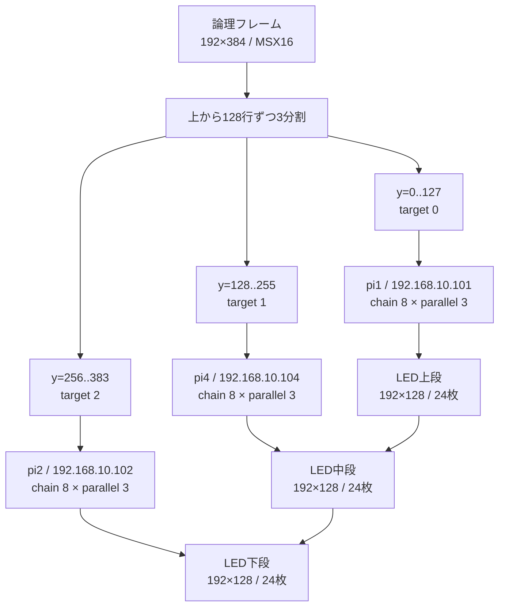
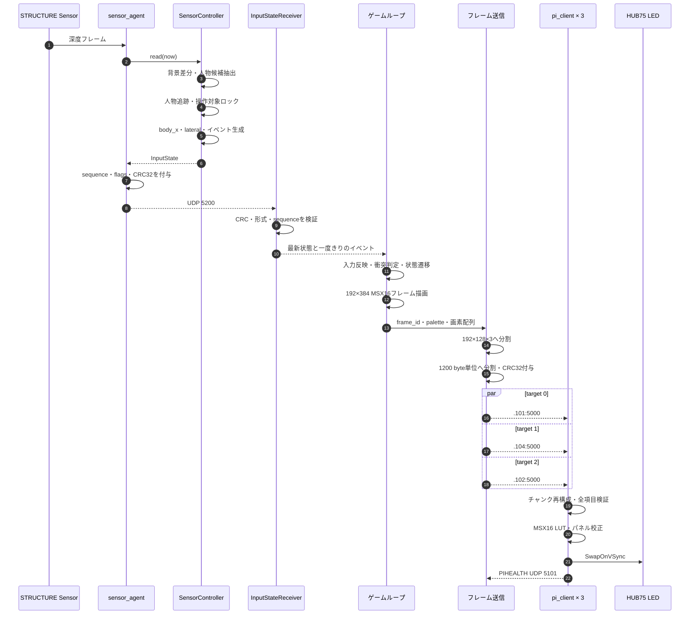
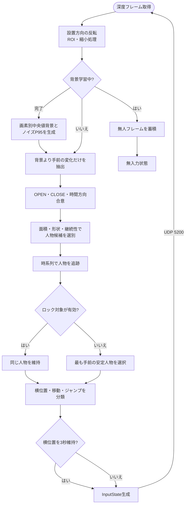
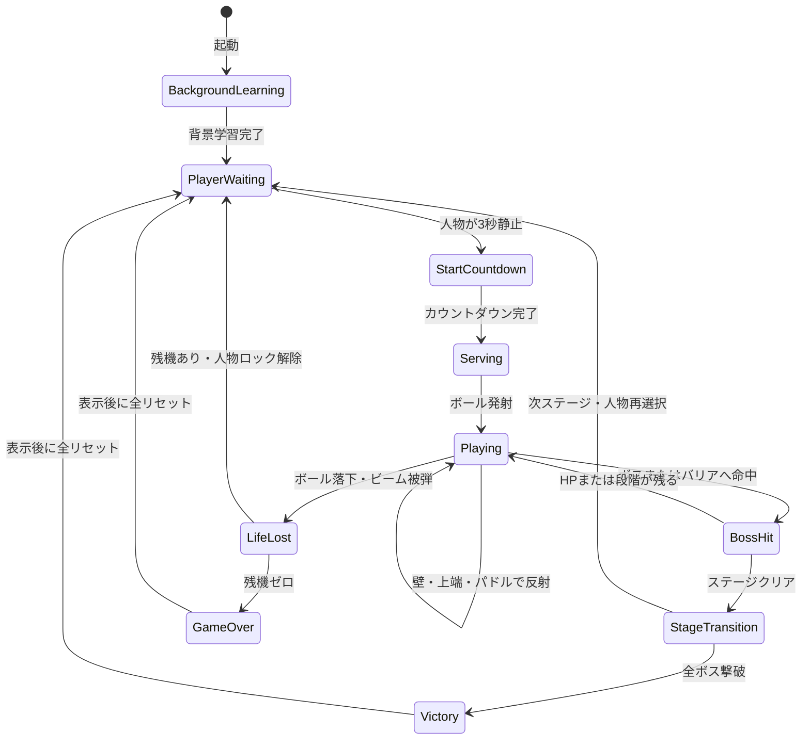
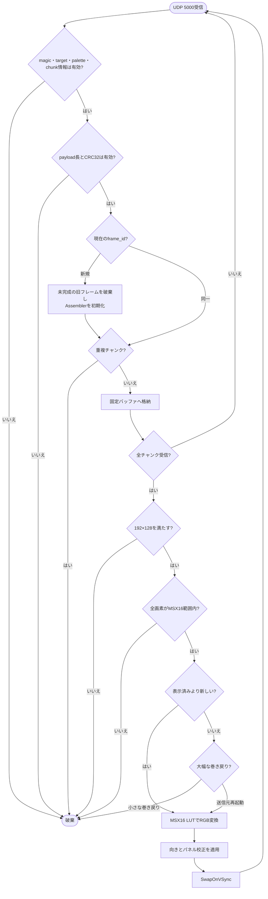
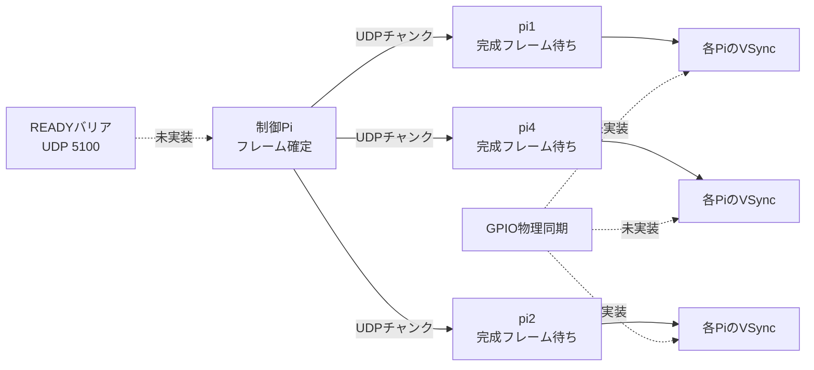

# 現行システム構成・処理ロジック

基準日: 2026-09-04

本書は [`../spec.md`](../spec.md) §4〜§8を図示したもの。仕様と図が矛盾する場合は
`spec.md` を正とする。制御Piと表示Pi 3台の値は実機の稼働サービスから確認済み。

## 1. システム構成

```mermaid
flowchart LR
    depthSensor["STRUCTURE Sensor"]

    subgraph inputNet["入力ネットワーク 192.168.50.0/24"]
        subgraph sensorPi["センサーPi<br/>pi3-sensor / .33"]
            capture["OpenNI2深度取得"]
            detection["背景差分・人物検出<br/>追跡・入力分類"]
            inputTx["sensor_agent.py<br/>入力状態送信"]
        end

        subgraph controlPi["制御Pi<br/>pi3-control / .32"]
            inputRx["入力受信<br/>CRC・sequence検証"]
            game["ゲーム更新<br/>60fps"]
            renderer["MSX16描画<br/>192×384"]
        end
    end

    subgraph displayNet["表示専用LAN 192.168.10.0/24"]
        frameTx["制御Pi表示側 / .2<br/>3分割・UDP送信"]
        networkSwitch["1 GbEスイッチ"]

        subgraph displayPis["表示Pi 3台"]
            pi1["上段: pi1 / .101<br/>target 0 / 192×128"]
            pi4["中段: pi4 / .104<br/>target 1 / 192×128"]
            pi2["下段: pi2 / .102<br/>target 2 / 192×128"]
        end
    end

    subgraph ledWall["RGB LED表示面 192×384"]
        upper["上段 24枚<br/>8列×3段"]
        middle["中段 24枚<br/>8列×3段"]
        lower["下段 24枚<br/>8列×3段"]
    end

    depthSensor -->|"USB深度フレーム"| capture
    capture --> detection --> inputTx
    inputTx -->|"判定済み入力 UDP 5200"| inputRx
    inputRx --> game --> renderer --> frameTx
    game -->|"人物再選択 UDP 5201"| inputTx
    frameTx --> networkSwitch
    networkSwitch -->|"UDP 5000 / target 0"| pi1
    networkSwitch -->|"UDP 5000 / target 1"| pi4
    networkSwitch -->|"UDP 5000 / target 2"| pi2
    pi1 --> upper
    pi4 --> middle
    pi2 --> lower
    pi1 -.->|"PIHEALTH UDP 5101"| frameTx
    pi4 -.->|"PIHEALTH UDP 5101"| frameTx
    pi2 -.->|"PIHEALTH UDP 5101"| frameTx
```

深度画像と人物マスクはセンサーPiから外へ送らない。ネットワークを流れるのは、
人物位置、左右入力、ジャンプ、開始イベント、人物IDなどの判定済み入力だけである。

## 2. LED表示面と送信順

宛先はIPアドレス順ではない。送信引数と物理表示順は必ず
`.101 → .104 → .102` の順に保つ。

## 3. 1フレームの処理シーケンス

## 4. センサー入力判定ロジック

入力が0.50秒以上途絶えた場合、制御Piは無入力へ戻す。古いsequence、不正CRC、
未定義flagsは破棄し、イベントフラグは新しいsequenceごとに一度だけ消費する。

## 5. ゲーム状態遷移

## 6. 表示Piの受信・表示ロジック

## 7. 現行の同期境界

現状は、各表示Piが完成フレームを個別に検証し、それぞれのVSyncで表示する同期段階Aである。
READYバリアとGPIO同期は現行の表示経路に含まれない。
