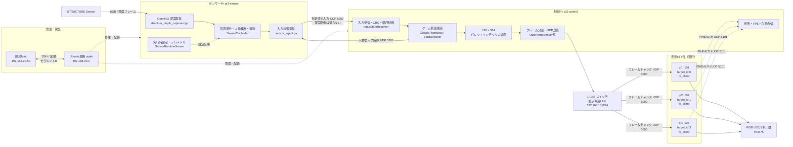
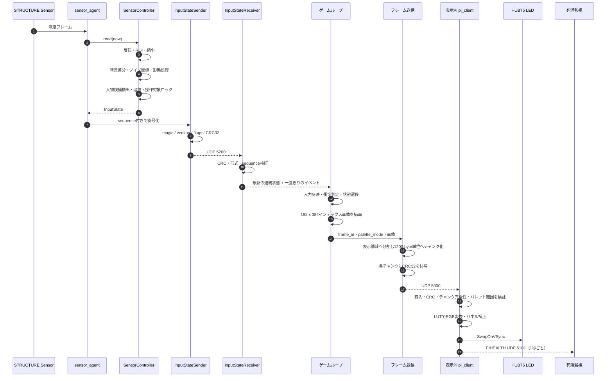
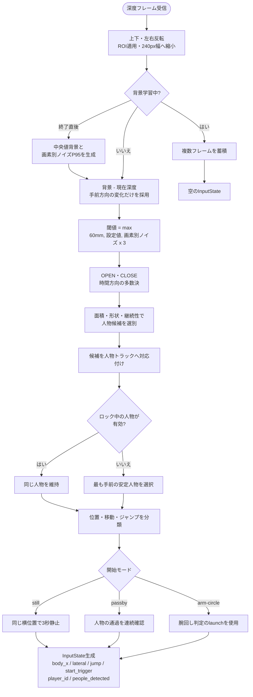
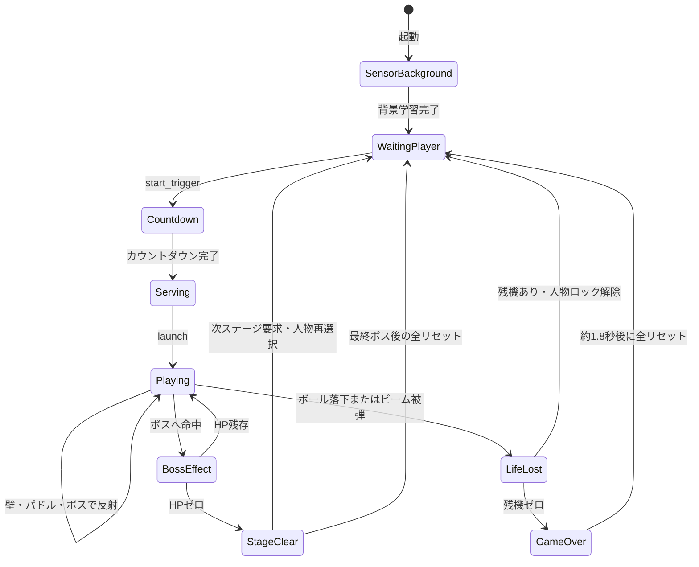
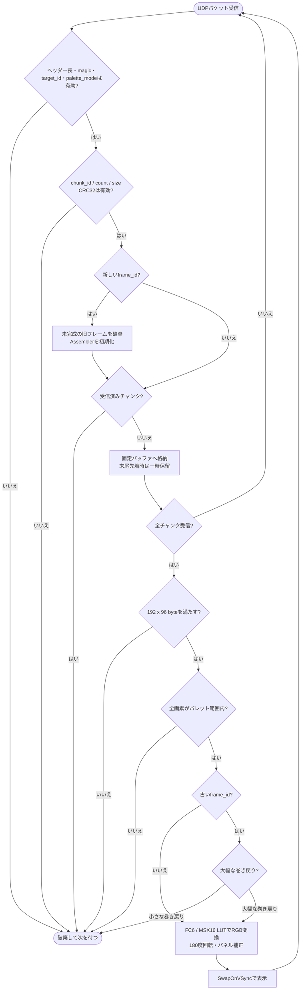

# [OUTDATED] システム構成・処理ロジック

> 2026-09-04の実機再確認前に作成した旧構成図。現行構成はリポジトリ直下の `README.md` と `spec.md` を参照する。

現行実機（2026-09-02時点）と、リポジトリ内の実装から読み取れる処理を Mermaid で示す。
接続先の正本は [`CONNECTION_INFO.md`](CONNECTION_INFO.md) とし、図中の「現行」は同文書に従う。

## 1. 現行システム構成

## 2. 1フレームの処理シーケンス

## 3. センサー入力判定ロジック

## 4. ゲーム進行ロジック

ゲームループ内では `dt` を最大40msへ制限し、ボール移動量に応じて最大8回のサブステップへ分割する。
各サブステップで左右壁、上端、パドル、ボス／バリア、画面下への落下を順に判定する。

## 5. 表示Piのフレーム受信ロジック

## 6. 実装状態と境界

- 現行実機は表示Pi 3台（`.101`、`.102`、`.104`）。`.103` / `target_id 2` は使わない。
- リポジトリ内の汎用 `UdpFrameSender` は、192×384を192×96の4領域へ分ける旧4台構成を前提とする。
  現行3台への送信は、制御Piへ配備済みの3台用サービス設定を使う。
- `READY` 応答（UDP 5100）とGPIO物理同期は未実装。現状は各表示Piが完成フレームを個別に
  `SwapOnVSync` する同期段階Aである。
- センサーPiから制御Piへ送るのは判定済みの入力状態だけで、深度画像・人物マスクは送らない。
- パレット定義の正本は `host/palettes.py` と `host/palettes.json`。

## 7. 主な実装対応

| 図の責務 | 実装 |
|---|---|
| 深度フレーム取得 | `host/structure_depth_capture.cpp`, `host/frame_source.py` |
| 背景差分・人物追跡・入力分類 | `host/block_breaker.py` の `SensorController` |
| センサー側常駐処理 | `host/sensor_agent.py` |
| 入力UDP・再選択制御 | `host/input_transport.py` |
| ゲーム更新・描画 | `host/block_breaker.py` の `ClassicThenBoss`, `BlockBreaker` |
| フレーム分割・UDP送信 | `host/test_mode/test_mode.py` の `UdpFrameSender` |
| 表示Piでの再構成・表示 | `pi-client/pi_client.cc` |
| 現行の接続先 | `docs/CONNECTION_INFO.md` |
